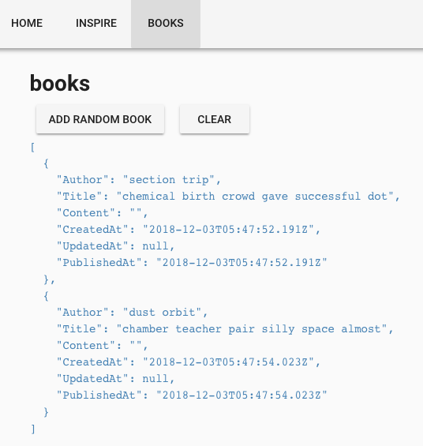
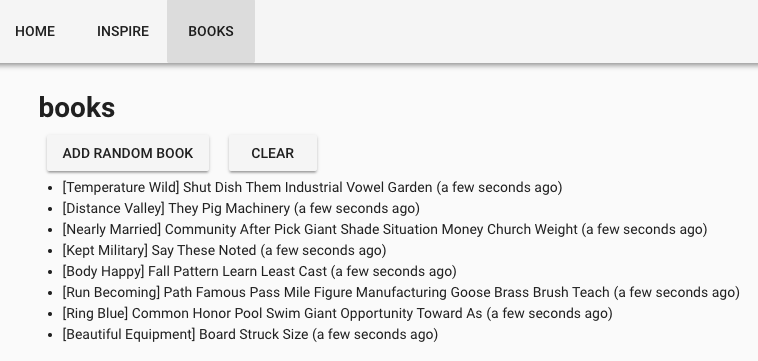

# hello-nuxt

> Vue + Nuxt + Vuetify example project

## References

[Developer Roadmap](https://github.com/kamranahmedse/developer-roadmap) - Frontend, Backend, Devops Roadmap

[Vue.js](https://vuejs.org) - The Progressive JavaScript Framework
[Nuxt.js](https://nuxtjs.org) - Universal Vue.js Applications
[Vuetify](https://vuetifyjs.com) - Material Design Component Framework

[Vue Router](https://router.vuejs.org) - the official router for Vue.js.
[Vuex](https://vuex.vuejs.org) - a state management pattern + library for Vue.js.

---

## How To Run

``` bash
# install dependencies
$ yarn install

# serve with hot reload at localhost:3000
$ yarn run dev

# build for production and launch server
$ yarn run build
$ yarn start

# generate static project
$ yarn run generate
```

---

## Step-by-step

---

### 1. Initialize

```bash
# install nodejs (LTS v8 or v10) https://nodejs.org
$ wget https://nodejs.org/dist/v10.x.x/node-v10.x.x-linux-x64.tar.xz
$ tar xf node-v10.x.x-linux-x64.tar.xz
$ export PATH=$PATH;node-v10.x.x-linux-x64/bin

# install yarn
$ npm i -g yarn

# create nuxt-app
$ yarn create nuxt-app hello-nuxt
# choose:
# none(server framework), vuetify, Single Page App
# axios, eslint, prettier, yarn

# run
$ cd hello-nuxt
$ yarn run dev
# Listening on: http://localhost:3000

# open browser and developer inspector
```

---

### 2. Nuxt Directory Structure
https://nuxtjs.org/guide/directory-structure
```bash
assets/
components/ # shared .vue
layouts/
middleware/
pages/ # vue-router (_xx/ this.$route.params.xx)
plugins/
static/ # serve raw file (favicon.ico, robots.txt)
store/ # vuex
nuxt.config.js # webpack (**/* => .html, .js, .css)
package.json
```

---

### 3. Vue file `commit 02c7dd2`
https://vuejs.org/v2/guide/single-file-components.html

<small>

```vue
<template>
  <pre class="hoho">{{ haha }}</pre>
</template>

<script>
export default {
  data () {
    return {
      haha: null
    }
  },
  async mounted () {
    let { data } = await this.$axios.get('https://dev.cerescloud.io/version.json'
    this.haha = data
  }
}
</script>

<style>
.hoho { color: red; }
</style>
```

</small>

---

### 4. Clean up pages `commit 2b041d5`

### 5. Simple CRUD page: /books

```javascript
// a book
{
  'Author': String,
  'Title': String,
  'Content': String,
  'CreatedAt': Date,
  'UpdatedAt': Date,
  'PublishedAt': Date
}
```

	$ yarn add random-words debug

---

#### 5-1. Create / Delete All `commit 6c9cbc8`



---

/pages/books.vue
```vue
<v-btn @click="addRandomBook()">add random book</v-btn>
<v-btn @click="books = []">clear</v-btn>
<pre class="hoho">{{ books }}</pre>
```
```vue
data() {
  return {
    books: []
  }
},
methods: {
  addBook(d) { ... },
  addRandomBook() { ... }
}
```

---

#### 5-2. v-for and plug-in 'vue-moment'  `commit ffab371`



```vue
<ul>
  <li v-for="(d, i) in books" :key="i">
    <span class="text-capitalize">[{{ d.Author }}]</span>
    <span class="text-capitalize">{{ d.Title }}</span>
    ({{ d.CreatedAt | moment('from') }})
  </li>
</ul>
```

---

#### 5-3. Store books to localStorage  `commit b3b539a`

pages/books.vue
```vue
import store from 'store'

// data
books: store.get('books') || []

// addBook()
this.books.push(Object.assign(baseBook, d))
store.set('books', this.books)

// clearBooks()
this.books = []
store.remove('books')
```

---

#### 5-4. Using REST api

books-go/main.go
```bash
$ go build books-go/main.go
$ ./main
# localhost:3010
# POST /books
# GET /books
# PUT /books/:id
# DELETE /books/:id
```

pages/books.vue
```vue
async addBook(d) {
  let { data } = await this.$axios.post('http://localhost:3010/books', d)
  this.books.push(data)
},

async fetchBooks() {
  let { data } = await this.$axios.get('http://localhost:3010/books')
  this.books = data
}
```