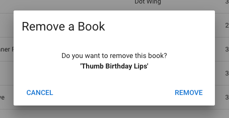

# hello-nuxt

> Vue + Nuxt + Vuetify example project

---

<!-- page_number: true -->

## References

Main

- [Vue.js](https://vuejs.org) - The Progressive JavaScript Framework
- [Nuxt.js](https://nuxtjs.org) - Universal Vue.js Applications
- [Vuetify](https://vuetifyjs.com) - Material Design Component Framework

Useful

- [Developer Roadmap](https://github.com/kamranahmedse/developer-roadmap) - Frontend, Backend, Devops Roadmap
- [Vue Router](https://router.vuejs.org) - the official router for Vue.js.
- [Vuex](https://vuex.vuejs.org) - a state management pattern + library for Vue.js.
- [lodash](https://lodash.com) - A modern JavaScript utility library delivering modularity, performance & extras.
- [axios](https://github.com/axios/axios) - Promise based HTTP client for the browser and node.js

---

## How To Run

``` bash
# install dependencies
$ yarn install

# serve with hot reload at localhost:3000
$ yarn run dev

# build for production and launch server
$ yarn run build
$ yarn start

# generate static project
$ yarn run generate
```

---

## Step-by-step

---

### 1. Setup Node.js, Nuxt app

```bash
# install nodejs (LTS v8 or v10) https://nodejs.org
$ wget https://nodejs.org/dist/v10.x.x/node-v10.x.x-linux-x64.tar.xz
$ tar xf node-v10.x.x-linux-x64.tar.xz
$ export PATH=$PATH;node-v10.x.x-linux-x64/bin

# install yarn
$ npm i -g yarn

# create nuxt-app
$ yarn create nuxt-app hello-nuxt
# choose:
# none(server framework), vuetify, Single Page App
# axios, eslint, prettier, yarn

# run
$ cd hello-nuxt
$ yarn run dev
# Listening on: http://localhost:3000

# open browser and developer inspector
```

---

### 2. Overview Nuxt

https://nuxtjs.org/guide/directory-structure

```bash
assets/
components/    # shared .vue
layouts/
middleware/
pages/         # vue-router $params, $query
plugins/
static/        # serve raw file (favicon.ico, robots.txt)
store/         # vuex
nuxt.config.js # webpack (**/* => .html, .js, .css)
package.json
```

---

### 3. Filetype .vue `commit 02c7dd2`

https://vuejs.org/v2/guide/single-file-components.html

<small style="font-size: 70%">

```vue
<template>
  <pre class="hoho">{{ haha }}</pre>
</template>

<script>
export default {
  data () {
    return {
      haha: null
    }
  },
  async mounted () {
    let { data } = await this.$axios.get('https://dev.cerescloud.io/version.json'
    this.haha = data
  }
}
</script>

<style>
.hoho { color: red; }
</style>
```

</small>

### 4. Clean up sample pages `commit 2b041d5`

---

## Simple CRUD page: /books

```javascript
// a book
{
  'Author': String,
  'Title': String,
  'Content': String,
  'CreatedAt': Date,
  'UpdatedAt': Date,
  'PublishedAt': Date
}
```

	$ yarn add random-words debug

---

### 5. Store to data() `commit 6c9cbc8`


---

/pages/books.vue

```html
<v-btn @click="addRandomBook()">add random book</v-btn>
<v-btn @click="books = []">clear</v-btn>
<pre class="hoho">{{ books }}</pre>
```

```javascript
data() {
  return {
    books: []
  }
},
methods: {
  addBook(d) { ... },
  addRandomBook() { ... }
}
```

---

### 6. v-for, vue-moment  `commit ffab371`


```vue
<ul>
  <li v-for="(d, i) in books" :key="i">
    <span class="text-capitalize">[{{ d.Author }}]</span>
    <span class="text-capitalize">{{ d.Title }}</span>
    ({{ d.CreatedAt | moment('from') }})
  </li>
</ul>
```

---

### 7. Store to localStorage  `commit b3b539a`

pages/books.vue

```vue
import store from 'store'

// data
books: store.get('books') || []

// addBook()
this.books.push(Object.assign(baseBook, d))
store.set('books', this.books)

// clearBooks()
this.books = []
store.remove('books')
```

---

### 8. Store to backend - REST API  `commit 64c7259`

books-go/main.go

<small>

```bash
$ go build books-go/main.go
$ ./main
# localhost:3010
# POST /books
# GET /books
# PUT  /books/:id
# DELETE /books/:id
```

</small>

pages/books.vue

```vue
async addBook(d) {
  let { data } = await this.$axios.post('http://localhost:3010/books', d)
  this.books.push(data)
},

async fetchBooks() {
  let { data } = await this.$axios.get('http://localhost:3010/books')
  this.books = data
}
```

---

### 9. vuex

store/store00.js

<div style="font-size: 65%;">

```javascript
export const state = () => ({
  books: []
})

export const mutations = {
  RECEIVE_BOOKS(state, data) {
    state.books = data
  },
  ADD_BOOK(state, data) {
    state.books.push(data)
  }
}

export const actions = {
  async fetchBooks({ commit }) {
    let { data } = await this.$axios.get('http://localhost:3010/books')
    commit('RECEIVE_BOOKS', data)
  },
  async addBook({ commit }, d) {
    let { data } = await this.$axios.post('http://localhost:3010/books', d)
    commit('ADD_BOOK', data)
  }
}

export const getters = {
  books(state) {
    return state.books
  }
}
```

</div>

---

pages/books.vue

```vue
import { mapActions, mapGetters } from 'vuex'

// computed
  ...mapGetters({
    books: 'store00/books'
  })

// methods
  ...mapActions({
    fetchBooks: 'store00/fetchBooks',
    addBook: 'store00/addBook'
  })
```

---

layouts/default.vue

```html
// template
<v-btn flat to="/books">
  books ({{ books.length || '-' }})
</v-btn>
```

```javascript
import { mapGetters } from 'vuex'

export default {
  computed: {
    ...mapGetters({
      books: 'store00/books'
    })
  }
}
```

---

### 10. v-data-table `commit 7476762`

https://vuetifyjs.com/en/components/data-tables


---

pages/books.vue

```html
<v-data-table
  :headers="headers" :items="books" hide-actions
>
  <template slot="items" slot-scope="props">
    <td class="text-capitalize">{{ props.item.Title }}</td>
    <td class="text-capitalize">{{ props.item.Author }}</td>
    <td>{{ props.item.CreatedAt | moment('from') }}</td>
  </template>
</v-data-table>
```
```javascript
data() {
  return {
    headers: [
      { text: 'Title', value: 'Title' },
      { text: 'Author', value: 'Author' },
      { text: 'Created', value: 'CreatedAt' }
    ]
  }
}
```

---

### 11. v-dialog `commit bf60c96`

https://vuetifyjs.com/en/components/dialogs


---

pages/books.vue

```html
<v-dialog v-model="dialogAdd" max-width="400">
  ...
</v-dialog>
```

```javascript
// data
dialogAdd: false,
newBook: { Title: '', Author: '' },

// methods
submitFormAdd() {
  this.addBook(this.newBook)
  this.dialogAdd = false
},
```

---



pages/books.vue - template

```html
<td>
  <v-btn
    flat small color="red" 
    @click="openRemoveDialog(props.item)"
  >Remove</v-btn>
></td>

<v-dialog v-model="dialogRemove" max-width="400">
  ...
</v-dialog>
```

---

pages/books.vue - script

```javascript
// data
dialogRemove: false,
bookToRemove: null

// methods
openRemoveDialog(d) {
  this.bookToRemove = d
  this.dialogRemove = true
},
handleRemoveBook() {
  this.removeBook(this.bookToRemove)
  this.dialogRemove = false
}
```

---

store/store00.js

	$ yarn add lodash

```javascript
// mutations
REMOVE_BOOK(state, data) {
  _.remove(state.books, ['ID', data.ID])
  state.books.push({})
  state.books.pop()
}

// actions
async removeBook({ commit }, d) {
  let { data } = await this.$axios.delete(
    `http://localhost:3010/books/${d.ID}`
  )
  commit('REMOVE_BOOK', d)
}
```

---

### 12. izitoast


	$ yarn add vue-izitoast

plugin/vue-izitoast.js

```javascript
import Vue from 'vue'
import VueIziToast from 'vue-izitoast'

import 'izitoast/dist/css/iziToast.css'

Vue.use(VueIziToast)
```
---

store/store00.js

```javascript
async fetchBooks({ commit }) {
  try {
    let data = await this.$axios.$get('http://localhost:3010/books')
    commit('RECEIVE_BOOKS', data)
  } catch (e) {
    let message = 'Failed to get books'
    if (e.response) {
      message += `<p>${e.response.status}: 
        ${e.response.data.message}</p>`
    }
    this.$toast.error(message)
  }
},
```

---

### 13. keycloak-js

    $ docker run -p 8080:8080 --name keycloak jboss/keycloak
    $ docker exec keycloak keycloak/bin/add-user-keycloak.sh -u user -p pass
    $ yarn add keycloak-js

- Add a new realm 'hello-nuxt' (User registration: on)
- Add a new client 'hello-nuxt-client'

static/keycloak.json
```jason
{
  "realm": "hello-nuxt",
  "auth-server-url": "http://localhost:8080/auth",
  "ssl-required": "external",
  "resource": "hello-nuxt-client",
  "public-client": true,
  "confidential-port": 0
}
```

---

nuxt.config.js

```
router: {
  middleware: ['auth']
},
```

middleware/auth.js

```javascript
export default function({ route, store, error }, next) {
  if (store.state.auth.authenticated) {
    // authenticated
    next()
  } else {
    // not loggedin
    if (routeOption(route, 'auth', false)) {
      // public page, just check sso
      store.dispatch('auth/checkSSO', next, error)
    } else {
      // page need authentication
      store.dispatch('auth/checkSSOAndLogin', next, error)
    }
  }
```

---

store/auth.js

```javascript
let keycloakAuth = new Keycloak('/keycloak.json')

export const mutations = {
  SET_TOKENS: (state, keycloakAuth) => { }
  SET_USER: (state, user) => { }
}

export const actions = {
  login()
  checkSSO()
  checkSSOAndLogin()   
  logout()
  updateToken()
  updateProfile()
}
```

---

layouts/default.vue

```html
<v-btn :disabled="!isAuthenticated" flat to="/books">books ({{ books.length || '-' }})</v-btn>

<v-btn v-if="!isAuthenticated" flat @click="login">login</v-btn>
<v-btn v-if="isAuthenticated" flat @click="logout">logout</v-btn>
```
```javascript
import { mapGetters, mapActions } from 'vuex'

export default {
  computed: {
    ...mapGetters({
      books: 'store00/books',
      isAuthenticated: 'auth/isAuthenticated'
    })
  },
  methods: {
    ...mapActions({
      login: 'auth/login',
      logout: 'auth/logout'
    })
  }
}
```

---

Next ...

- nuxt-child
- grid, flex, display, position
- components
